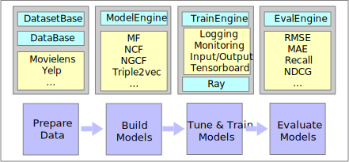

# Overview of the Framework

  

Beta-RecSys provides an end-to-end workflow for researchers and practitioners to build their new models or use the built-in models. It also provides a standardized way to configure model training and evaluate the resultant models under a unified framework. 

## Prepare Data
To make the workflow efficient, we implement two key reusable components for preparing training
data for different recommender models. The BaseDataset component provides unified interfaces for processing the raw dataset into interactions and splitting it using common strategies (e.g. leave-one-out, random split or temporal split) into training/validation/testing sets. Meanwhile the BaseData provides the tools to further convert the resultant data sets into usable data structures (e.g. tensors with < 𝑢𝑠𝑒𝑟,𝑖𝑡𝑒𝑚, 𝑟𝑎𝑡𝑖𝑛𝑔 > or < 𝑢𝑠𝑒𝑟, 𝑝𝑜𝑠𝑖𝑡𝑖𝑣𝑒_𝑖𝑡𝑒𝑚, 𝑛𝑒𝑔𝑎𝑡𝑖𝑣𝑒_𝑖𝑡𝑒𝑚(𝑠) >), dependant on the requirements/supported features of the target model. Out-of-the-box we support a number of commonly used datasets, including Movielens_100k, Movielens_1m, Movielens_25m, LastFM.

## Build Models
Our project provides a model engine (i.e. represented by the class ModelEngine) for conveniently building a pytorch recommender model in a unified manner. In particular, it provides a unified implementation for saving and loading models, specifying the compute device, optimizer and loss (e.g. BPR loss or BCE loss) to use during training. Out-of-the-box, 9 recommendation models are provided, including classic baselines like MF, as well as more advanced neural models such as NCF, NGCF and Triple2vec.

## Train & Tune Models
The TrainEngine component provides unified mechanisms to manage the end-to-end training
process. This encompasses: loading the configuration; loading the data; training each epoch; calculating validation performance; checkpointing models; testing early stopping criteria; and calculating the final test performance. The TrainEngine also supports monitoring/visualizing the training progress in real time, including resource consumption and training metrics (such as the training loss and evaluation performance on both the validation and testing sets) of a deployed model via Tensorboard. It can also expose these real-time metrics to a Prometheus time-series data store via an in-built Prometheus exporter, enabling programmatic access to the training state. To support easier and faster hyperparameter tuning for each model, we also integrate the Ray framework 8 , which is a Python library for model training at scale. This enables the distribution of model training/tuning across multiple gpus and/or compute nodes.

## Evaluate Performance
Three categories of commonly used evaluation metrics for recommender system are included in this platform, namely rating metrics, ranking metrics and classification metrics. For rating metrics, we use Root Mean Square Error (RMSE), R Squared (𝑅2) and Mean Average Error (MAE) to measure the effectiveness. For ranking metrics, we included Recall, Precision, Normalized Discounted Cumulative Gain (NDCG) and Mean Average Precision (MAP) to measure performance of ranking lists. Model evaluation using build-in classification metrics like Area-Under-Curve (AUC) and Logistic loss are also supported. For detailed definitions of these metrics, readers are referred to [1]. To accelerate the evaluation process, the metric implementations are multi-threaded.

[1] Asela Gunawardana and Guy Shani. 2009. A survey of accuracy evaluation metrics of recommendation tasks. Journal of Machine Learning Research
10, Dec (2009), 2935–2962.
